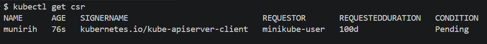
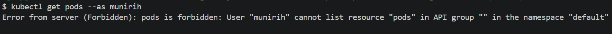

# A step-by-step guide on how to add a user in Kubernetes with certificates and RBAC

### Pre-requisite

- openssl installed 


### Step 1. Authenticate the new user 

#### 1.1 Generate a private key

Creates a private key for our new in order to create a certificate signing request:

`openssl genrsa -out user-name.key 2048`

#### 1.2 Create a Certificate Signing Request (CSR)

Create a CSR using the private key for the user in group `dev`, the output of the following command will be used to create a CSR kubernetes resource. 
If you are running Git bash on windows you may want to start the command with `MSYS_NO_PATHCONV=1` then

`openssl req -new -key user-name.key -out user-name.csr -subj "/CN=user-name/O=dev"`

This tells Git Bash not to treat /CN=... as a filesystem path.

#### 1.3 Encode the CSR in base64

The output will be used in the Kubernetes resource.

`cat user-name.csr | base64 | tr -d "\n"`

#### 1.4 Create a Kubernetes CSR Resource 

create a file named `user-csr.yaml` and insert the following configuration:

```yaml
apiVersion: certificates.k8s.io/v1
kind: CertificateSigningRequest
metadata:
  name: user-name
spec:
  request: <paste the encoded csr here>
  signerName: kubernetes.io/kube-apiserver-client
  expirationSeconds: 864000  # 10 days
  usages:
  - client auth
  ```

Copy the encoded CSR into the file and then edit or omit the expiration date (in seconds) of the CSR.
Apply the yaml file to create the CSR resource.

`kubectl apply -f user-csr.yaml`


#### 1.5 Check the status of CSR

`kubectl get csr`

The expected output will be like this:



The request is `pending` and needs to be approved or denied by an authorised Kubernetes admin which you are login. Use the following command to approve:

`kubectl certificate approve user-name`

#### 1.6 Get the signed certificate

The user certificate has to be retrieved, decoded from the approved CSR and stored in a .crt file. This will be used to create to add the user in the kubeconfig file later.

`kubectl get csr user-name -o jsonpath='{.status.certificate}'| base64 -d > user-name.crt`


#### 1.7 Add new user in kubernetes configuration file 

`kubectl config set-credentials user-name --client-key=user-name.key --client-certificate=user-name.crt --embed-certs=true`

#### 1.8 Create a context for new user 

A context is a combination of user and cluster to tell kubectl which user and which ckuster to talk to, this allows you to switch between environments.

`kubectl config set-context user-context-name --cluster=local-cluster --user=user-name`

#### 1.9 View all contexts

`kubectl config get-contexts`

#### 1.10 Switch to the new-user context

`kubectl config use-context user-context-name`

#### 1.11 Test authentication 

`kubectl auth whoami`

Switch back to the admin before proceeding to the next step

`kubectl config use-context admin-context-name`

### Step 2. Authorize User

At this point the new user has been authenticated, however he/she does not yet have permission to access certain resources in a namespace. By running the following command, you can impersonate the user to verify whether they have permission or not:

`kubectl auth can-i get pods --as user-name`

or you can run the following:

`kubectl get pods --as user-name`

The expected output will be something like this: 




#### 2.1 Create a role and role binding 

A role defines what actions a new or groups of users can perform within a specified namespace and a role binding connects a user to the role.

- Create a yaml file for role granting permission to the user to view pods within the default namespace. 

dev-role.yaml
```yaml
apiVersion: rbac.authorization.k8s.io/v1
kind: Role
metadata:
  namespace: default
  name: pod-reader
rules:
- apiGroups: [""] # "" indicates the core API group
  resources: ["pods", "pods/log"]
  verbs: ["get", "watch", "list"]
```

- Create a yaml file for role binding
  
dev-role-binding.yaml
```yaml
apiVersion: rbac.authorization.k8s.io/v1
# This role binding allows "user" to read pods in the "default" namespace.
# You need to already have a Role named "pod-reader" in that namespace.
kind: RoleBinding
metadata:
  name: dev-pod-reader-binding
  namespace: default
subjects:
# You can specify more than one "subject"
- kind: User
  name: <replace-with-user-name> # "name" is case sensitive
  apiGroup: rbac.authorization.k8s.io
roleRef:
  # "roleRef" specifies the binding to a Role / ClusterRole
  kind: Role #this must be Role or ClusterRole
  name: pod-reader # this must match the name of the Role or ClusterRole you wish to bind to
  apiGroup: rbac.authorization.k8s.io
```

- Apply both files

`kubectl apply -f role.yaml`

`kubectl apply -f role-binding.yaml`

- Test authorisation

`kubectl auth can-i get pods --as user-name`

- Switch to the new context and run command to get pods

`kubectl config use-context user-context-name`

`kubectl get pods`

- Switch back to admin context and create a new namespace 

`kubectl config use-context admin-context-name`

#### 2.2 Allow Cluster permission

The user can only view pods within the default namespace however he/she cannot create a pod nor view a pod in a namespace.

- Create a new namespace named 'test'

`kubectl create ns test`

- Create a pod in namespace test

`kubectl run nginx --image=nginx -n test`

- Switch to user-context to test if the user can list pods in test namespace:

`kubectl get pods -n test`

The output will be a forbidden error. The solution will be to grant user access to list pods within the cluster.

- Switch back again to admin 

`kubectl config use-context admin-context-name`

- Create Cluster-Role yaml file to grant the user to list pods within a cluster

```yaml 
apiVersion: rbac.authorization.k8s.io/v1
kind: ClusterRole
metadata:
  name: pod-reader
rules:
- apiGroups: [""]
  verbs: ["get", "watch", "list"]
  resources: ["pods", "pods/log"]
```
- Create a cluster-role-binding yaml file to bind the user to the cluster role

```yaml
apiVersion: rbac.authorization.k8s.io/v1
kind: ClusterRoleBinding
metadata:
  name: pod-reader-global
subjects:
- kind: User
  name: munirih
  apiGroup: rbac.authorization.k8s.io
roleRef:
  kind: ClusterRole
  name: pod-reader
  apiGroup: rbac.authorization.k8s.io
```
- Apply both files

`kubectl apply -f cluster-role.yaml`

`kubectl apply -f cluster-role-binding.yaml`

- Switch to user context

`kubectl config use-context user-context-name`

- Test if you can now list pods 

`kubectl get pods -n test`

- Switch back to admin context before proceeding to the next step

`kubectl config use-context admin-context-name`


