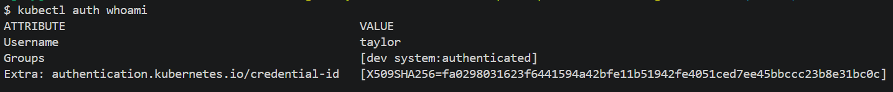
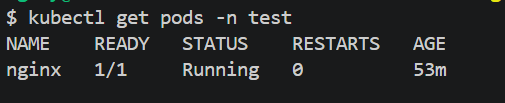
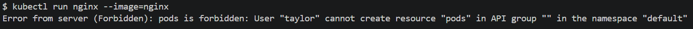
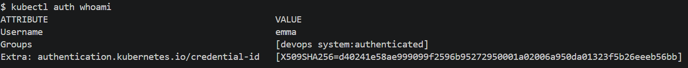
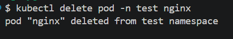
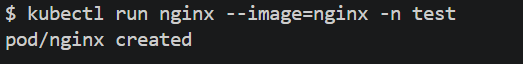

# Handling Multiple Users

Refer to the authentication and authorisation documentation [here](./AUTH.md) for a detailed guide on authentication and authorisation.

We will create three additional users, Jordan, Emma and Taylor. Jordan and Emma will be assigned to the group `devops` and Taylor will be assigned to the group `dev`. The devops group can create, delete and list pods while the dev group can anly list pods. 


- User 1: Jordan 
```
# Private key
openssl genrsa -out jordan.key 2048

# create CSR
MSYS_NO_PATHCONV=1 openssl req -new -key jordan.key -out jordan.csr -subj "/CN=jordan/O=devops"

# Encode CSR
cat jordan.csr | base64 | tr -d "\n"
```

- create jordan-csr.yaml
```yaml
apiVersion: certificates.k8s.io/v1
kind: CertificateSigningRequest
metadata:
  name: jordan
spec:
  request: <paste encoded base64 csr here>
  signerName: kubernetes.io/kube-apiserver-client
  usages:
  - client auth
```

- User 2: Emma 
```
# private key
openssl genrsa -out emma.key 2048

# create CSR
MSYS_NO_PATHCONV=1 openssl req -new -key emma.key -out emma.csr -subj "/CN=emma/O=devops"

# Encode CSR
cat emma.csr | base64 | tr -d "\n"
```
- Create emma-csr.yaml

```yaml
apiVersion: certificates.k8s.io/v1
kind: CertificateSigningRequest
metadata:
  name: emma
spec:
  request: <paste encoded base64 csr here>
  signerName: kubernetes.io/kube-apiserver-client
  usages:
  - client auth
```

User 3: Taylor
```
# private key
openssl genrsa -out taylor.key 2048

# create CSR
MSYS_NO_PATHCONV=1 openssl req -new -key taylor.key -out taylor.csr -subj "/CN=taylor/O=dev"

# encode CSR
cat taylor.csr | base64 | tr -d "\n"
```
Create taylor-csr.yaml
```yaml
apiVersion: certificates.k8s.io/v1
kind: CertificateSigningRequest
metadata:
  name: taylor
spec:
  request: <paste encoded base64 csr here>
  signerName: kubernetes.io/kube-apiserver-client
  usages:
  - client auth
```

- Apply files 
```
kubectl apply -f jordan-csr.yaml
kubectl apply -f emma-csr.yaml
kubectl apply -f taylor-csr.yaml
```

- Approve signing certificates
```
kubectl certificate approve jordan
kubectl certificate approve emma
kubectl certificate approve taylor
```

- Get signed certificates
```

kubectl get csr jordan -o jsonpath='{.status.certificate}' | base64 -d > jordan.crt
kubectl get csr emma -o jsonpath='{.status.certificate}' | base64 -d > emma.crt
kubectl get csr taylor -o jsonpath='{.status.certificate}' | base64 -d > taylor.crt
```
- Add users to KubeConfig file
```

kubectl config set-credentials jordan --client-key=jordan.key --client-certificate=jordan.crt --embed-certs=true

kubectl config set-credentials emma --client-key=emma.key --client-certificate=emma.crt --embed-certs=true

kubectl config set-credentials taylor --client-key=taylor.key --client-certificate=taylor.crt --embed-certs=true
```
- Create context for each user
```

kubectl config set-context jordan-context --cluster=local-cluster --user=jordan

kubectl config set-context emma-context --cluster=local-cluster --user=emma

kubectl config set-context taylor-context --cluster=local-cluster --user=taylor
```

- List all contexts
  
`kubectl config get-contexts`


- Modify the cluster-role-binding file for the dev group.

dev-cluster-role-binding.yaml
```yaml

apiVersion: rbac.authorization.k8s.io/v1
kind: ClusterRoleBinding
metadata:
  name: dev-pod-reader-global

subjects:
- kind: Group
  name: dev
  apiGroup: rbac.authorization.k8s.io

roleRef:
  kind: ClusterRole
  name: pod-reader
  apiGroup: rbac.authorization.k8s.io

```

- Create a devops-cluster-role and devops-cluster-role-binding file for devops group

devops-cluster-role.yaml
```yaml
apiVersion: rbac.authorization.k8s.io/v1
kind: ClusterRole
metadata:
  name: pod-cluster-manager
rules:
- apiGroups: [""]
  verbs: ["get", "watch", "list", "create", "delete"]
  resources: ["pods", "pods/log"]
```

devops-cluster-role-binding.yaml
```yaml
apiVersion: rbac.authorization.k8s.io/v1
kind: ClusterRoleBinding
metadata:
  name: pod-cluster-manager-global
subjects:
- kind: Group
  name: devops
  apiGroup: rbac.authorization.k8s.io
roleRef:
  kind: ClusterRole
  name: pod-cluster-manager
  apiGroup: rbac.authorization.k8s.io
  ```

- Apply all files 


`kubectl apply -f dev-cluster-role-binding.yaml`

`kubectl apply -f devops-cluster-role.yaml`

`kubectl apply -f devops-cluster-role-binding.yaml`

- Switch to any user's context in dev group

`kubectl config use-context user-context`

`kubectl auth whoami`

- Test permissions

`kubectl get pods -n test`

The following command will produce an error as dev group can only view pods.

`kubectl run nginx --image=nginx`

Expected outputs





- Switch to any user's context in devops group

`kubectl config use-context user-context`

`kubectl auth whoami`

- Test permissions 

`kubectl get pods -n test`

`kubectl delete po -n test nginx` 

`kubectl run nginx --image=nginx -n test`

Expected outputs







### Create a Service Account

A service account is a non-human account used by applications to interact with the kubernetes cluster.

Switch to admin context

`kubectl config use-context admin-user-context`

Create a service account

`kubectl create sa test-sa`

Modify the cluster-role-binding yaml file to bind the service account to cluster role:

```yaml
apiVersion: rbac.authorization.k8s.io/v1
kind: ClusterRoleBinding
metadata:
  name: pod-cluster-manager-global
subjects:
- kind: Group
  name: devops
  apiGroup: rbac.authorization.k8s.io
- kind: ServiceAccount
  name: test-sa
  namespace: default
roleRef:
  kind: ClusterRole
  name: pod-cluster-manager
  apiGroup: rbac.authorization.k8s.io
```


